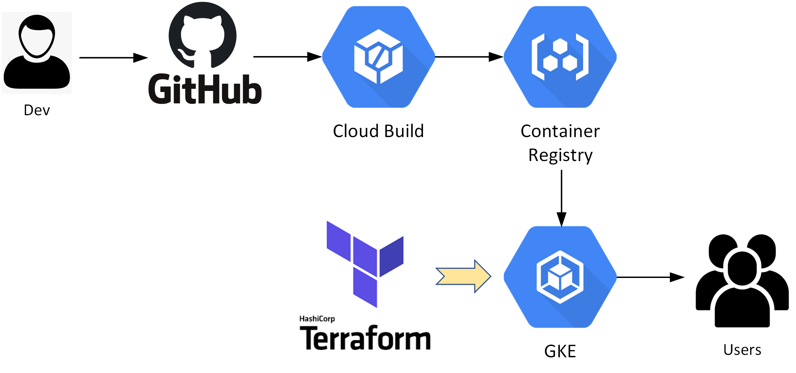

# nodejs-cloudbuild-demo
A basic nodejs app that is containerised and packaged through Helm Chart for fast GKE/K8s deployment.  
This example also includes a simple CI/CD pipeline deployed in the Google Cloud (GCP) envrionemt, leveraging cloud native platfroms and pipeline tools such as Google Kubernetes Engine (GKE),  Google Cloud Build and Google Container Registry (GCR).

---
## Guide
- [Refer to my Blog at here](https://route179.wordpress.com/2020/06/09/create-a-ci-cd-pipeline-with-gke-gcr-and-cloud-build/)
