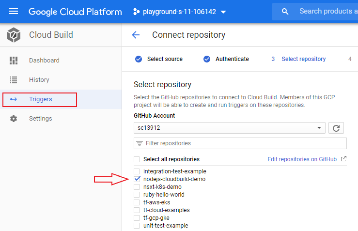
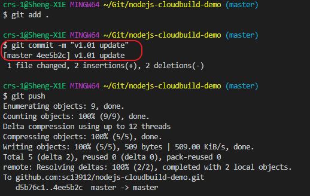
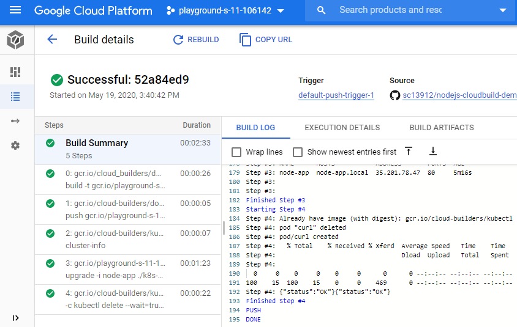
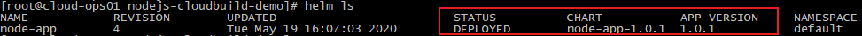
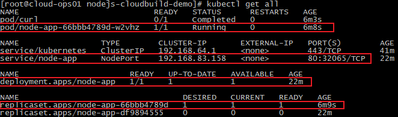
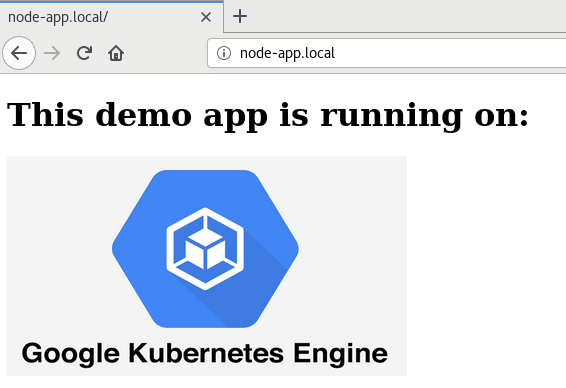

# nodejs-cloudbuild-demo
A basic nodejs app that is containerised and packaged through Helm Chart for fast GKE/K8s deployment.  
This example also includes a simple CI/CD pipeline deployed in the Google Cloud (GCP) envrionemt, leveraging cloud native platfroms and pipeline tools such as Google Cloud Build, Google Kubernetes Engine (GKE) and Google Container Registry (GCR).


## Prerequisites
* Access to a GCP envrionment
* Install Git, Kubectl, GCloud SDK & Terraform
* Check NTP clock sync status on your client!
* Download or Fork below link to your own Git repo
```
https://github.com/sc13912/nodejs-k8s-demo.git
```


## Step-1: Prepare the GCP/GKE Envrionment
### Configure GCloud Authentication
```
gcloud init
gcloud config set accessibility/screen_reader true
gcloud auth application-default login
gcloud auth configure-docker
```

### Enable Required GCP APIs
```
gcloud services enable compute.googleapis.com
gcloud services enable servicenetworking.googleapis.com
gcloud services enable cloudresourcemanager.googleapis.com
gcloud services enable container.googleapis.com
gcloud services enable cloudbuild.googleapis.com
```

### Update Cloud Build service account permissions
```
PROJECT_ID=`gcloud config get-value project`
CLOUDBUILD_SA="$(gcloud projects describe $PROJECT_ID --format 'value(projectNumber)')@cloudbuild.gserviceaccount.com"
gcloud projects add-iam-policy-binding $PROJECT_ID --member serviceAccount:$CLOUDBUILD_SA --role roles/editor
```


## Step-2: Launch a GKE cluster using Terraform
For detailed steps, you could refer to an example at here:
```
https://github.com/sc13912/tf-gcp-gke.git
```


## Step-3: Prepare the GKE/K8s envrionment for pipeline run
### Register cluster and update kubeconfig file (in order to use kubectl)
``` 
gcloud container clusters get-credentials node-pool-cluster-demo --region australia-southeast1
``` 

### Deploy a NGINX Ingress Controller - Required for the Helm Chart
```
kubectl apply -f https://raw.githubusercontent.com/kubernetes/ingress-nginx/controller-0.32.0/deploy/static/provider/cloud/deploy.yaml  
```

### Prepare Tiller and Initialise Helm for app deployment 
```
kubectl apply -f ./k8s-helm/tiller.yaml
helm init --history-max 200 --service-account tiller
```

### Build & push a Helm image to GCR for pipeline run
```
cd ./k8s-helm/cloud-builders-community/helm
docker build -t gcr.io/$PROJECT_ID/helm .
docker push gcr.io/$PROJECT_ID/helm
```

## Step-4: Deploy a CI/CD pipeline levearging Cloud Build, GKE and GCR
* Configure a pipeline trigger in Cloud Build to link to your own Git repo


* Now make a Helm chart verson change (1.0.0 > 1.0.1) & commit/push to Git


* Verify the pipeline has been trigged and monitor the (fully automated) build/deployemnt/testing process


* Verify the Helm chart deployment status on your GKE cluster



* Access and check the demo app (may need to update the local host file A record for "node-app.local" to point to the NGINX Ingress public address)
